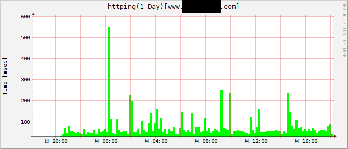

httping を使って HTTP の応答時間を記録してグラフ化する
################################################################

はじめに
================

HTTP の応答時間、すなわち `web サーバの遅延を測定` し、記録してグラフ化します。

ping（ICMP）だとサーバそのものの健全性は分かるのですが、HTTP サービスが生きているかはわかりません。そこで、`web サーバの遅延を測定` してくれる `httping(*1)` を利用し http の応答時間を尺度に web サーバーの健全性を図るものです。

.. note::

    言うまでもないですが、サーバまでの通信経路に問題がある場合は、httping の値は大きくなります。LAN 内などでの測定がいいかもしれません。

.. warning::
	
    本ツールは任意のサーバの httping 値を記録することができます。が、ご自身のサーバに対してのみ実施してください。
	
    他のサーバにやりすぎると負荷がかかります（c.f. *岡崎市立中央図書館事件* ）。

インストール
===================

パッケージのインストール
---------------------------

必要なパッケージをインストールします。今回は ubuntu を用いているので次のようになります::

    sudo apt install httping
    sudo apt install rrdtool

参考
=================

1: https://linux.die.net/man/1/httping

